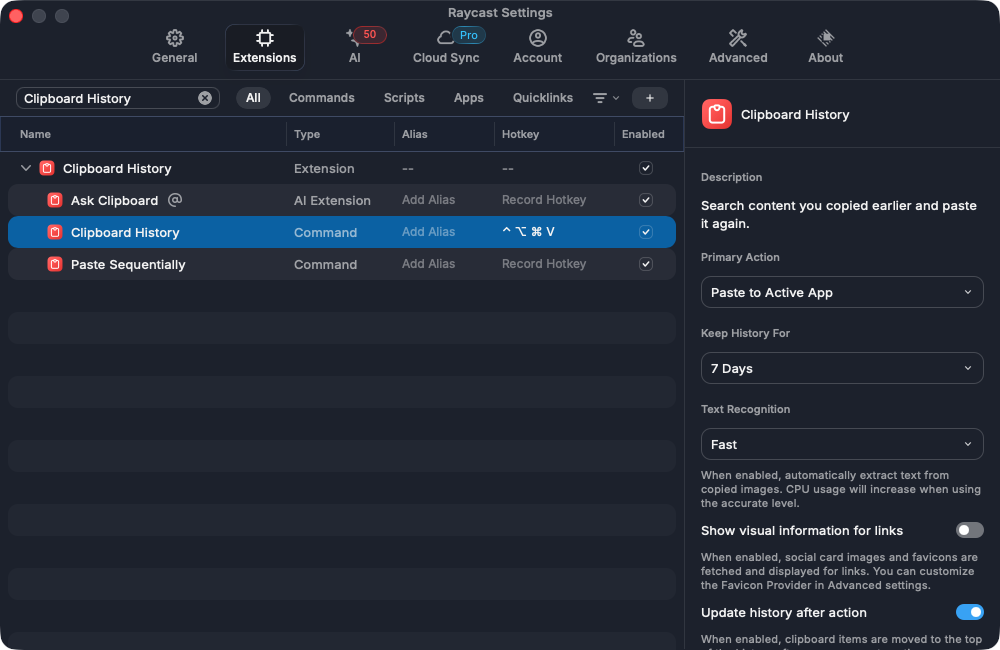

# Bright Data Mini Keypad — macOS 단축키 설정

**Bright Data 굿즈 3키 + 노브 매크로 키패드를 클립보드 기록, 음악 재생·일시정지, 화면 끄기 버튼으로.**

[](LICENSE) [](#빠른-시작) [](#지원-기기와-구성)

Open-source macOS presets and a Bash helper for the **Bright Data 3-key, 1-knob mini macro keypad**
(WCH CH57x, USB `1189:8890`). Configure Raycast Clipboard History, media play/pause, and display sleep
with [`ch57x-keyboard-tool`](https://github.com/kriomant/ch57x-keyboard-tool).

<p align="center">
  
</p>

> Bright Data에서 받은 **하드웨어 굿즈의 비공식 설정 프로젝트**입니다.
> Bright Data의 웹 스크래핑·프록시·데이터 수집 서비스를 설정하는 도구는 아닙니다.

[사용 예시](#이렇게-씁니다) · [빠른 시작](#빠른-시작) · [프리셋](#프리셋-목록) · [FAQ](#자주-묻는-질문) · [검증 기록](docs/VERIFICATION.md)

## 이렇게 씁니다

현재 사용하는 [`mac-work`](presets/mac-work.yaml) 프리셋입니다.
**클립보드 버튼과 Chrome의 YouTube 정지·재개는 실제 키패드 버튼으로 확인했습니다.**

| 조작 | 하는 일 | 쓰는 순간 |
|---|---|---|
| **키1** | Raycast 클립보드 기록 열기 | 아까 복사했던 링크·명령어·이미지를 다시 찾을 때 |
| **키2** | 미디어 재생 / 일시정지 | Chrome을 뒤에 두고 일하다 음악을 잠깐 멈출 때 |
| **키3** | 디스플레이만 끄기 | 화면을 꺼두고 자리를 비울 때 — 화면 잠금과는 다름 |
| 노브 회전 | 시스템 볼륨 작게 / 크게 | 마우스로 볼륨 슬라이더를 찾는 대신 돌려서 조절 |
| 노브 누름 | 시스템 음소거 | 재생 위치는 그대로 진행하고 소리만 끄기 |

**키1·키2·키3은 설정 파일의 순서입니다.** 사진의 위·중간·아래 위치와의 대응은
추정하지 않습니다. 처음 설정하는 기기는 아래의 `identify` 프리셋으로 확인하세요.

노브는 볼륨키보다 손이 잘 닿을 때 유용합니다. 기존 키보드나 마우스가 더 편한 기능까지
옮길 필요는 없습니다. 이 구성에서도 Shottr 영역 캡처는 키보드의 `⌥⇧S`로 계속 쓸 수 있습니다.

## 지원 기기와 구성

| 항목 | 이 저장소의 대상 |
|---|---|
| 하드웨어 | Bright Data 굿즈 미니 키패드, 3키 + 회전·누름 노브 1개 |
| USB VID:PID | `1189:8890` — 십진수 `4489:34960` |
| 칩 계열 / 매핑 모델 | WCH CH57x / `model: ch57x-2` |
| 설정 도구 | Rust CLI `ch57x-keyboard-tool` — 이 환경에서 검증한 버전 `1.8.0` |
| 이 저장소 | 의존성 없는 Bash 래퍼 `kp` + YAML 프리셋 — 실제 업로드는 위 CLI가 담당 |
| 앱 연동 | 클립보드: Raycast / 캡처 프리셋: Shottr |
| 저장 위치 | 키 매핑은 기기의 온보드 메모리, 앱의 핫키·클립보드 기록은 해당 컴퓨터 |

비슷하게 생긴 키패드라도 프로토콜이 다를 수 있습니다. 다른 기종은
[업스트림 지원 목록](https://github.com/kriomant/ch57x-keyboard-tool#supported-keyboards)을 먼저 확인하세요.

## 빠른 시작

### 1. 저장소와 설정 도구 준비

macOS 터미널에서 실행합니다. `cargo`가 없으면 [Rust 설치 안내](https://rustup.rs/)를 먼저 따르세요.
설치 후 새 터미널을 열어 `cargo --version`이 실행되는지 확인합니다.

```bash
git clone https://github.com/IISweetHeartII/brightdata-mini-keypad.git
cd brightdata-mini-keypad

# 이 저장소에서 검증한 버전
cargo install ch57x-keyboard-tool --version 1.8.0

# 프리셋 목록 — 기기에 쓰지 않는 조회 명령
./kp
```

`1.8.0`은 [crates.io 배포 버전](https://crates.io/crates/ch57x-keyboard-tool/1.8.0)으로 확인했습니다.
GitHub의 Latest 릴리스 표시는 패키지 배포 버전과 다를 수 있습니다.

### 2. USB 연결과 물리 버튼 순서 확인

```bash
# VID/PID를 확인: idVendor 4489, idProduct 34960
ioreg -p IOUSB -w0 -l | grep -B 20 -A 10 '"idProduct" = 34960'

# 주의: 현재 기기 매핑을 1 / 2 / 3 테스트 입력으로 교체합니다.
./kp identify
```

빈 텍스트 입력창에서 세 버튼을 눌러 어떤 위치에 `1`, `2`, `3`이 입력되는지 확인합니다.
노브는 볼륨·음소거입니다. macOS의 키보드 식별 마법사는 닫아도 됩니다.

### 3. Raycast 클립보드 핫키 연결

[Raycast](https://www.raycast.com/) 설정에서 **Clipboard History 명령**의 전역 핫키를
**`⌃⌥⌘V` — Control + Option + Command + V**로 지정합니다.

아래는 실제 설정 화면입니다. Raycast **1.104.28**에서는
**Settings → Extensions → “Clipboard History” 검색 → Command 행 → Record Hotkey** 순서입니다.
다른 버전에서는 [공식 핫키 안내](https://manual.raycast.com/command-aliases-and-hotkeys)를 참고하세요.



*실제 설정 캡처. 클립보드 내용은 포함하지 않았습니다. `7 Days`는 이 환경에서 선택된 보관 기간이며 변경 가능합니다.*

### 4. 업무용 프리셋 적용

```bash
# 기기의 키 매핑을 교체합니다.
./kp mac-work
```

- **키1:** 클립보드 목록이 열리는지 확인합니다. 검색어를 입력해 이전 항목을 찾을 수 있습니다.
- **키2:** Chrome에서 YouTube 영상을 재생한 뒤 다른 앱으로 이동해 누릅니다. 정지 후 다시 누르면 재개되는지 확인합니다.
- **키3:** 화면을 꺼도 되는 때 눌러 디스플레이 끄기를 확인합니다.

`upload` 성공은 **기기에 설정을 썼다는 뜻**입니다. 원하는 동작까지 확인하려면 실제 버튼을 눌러야 합니다.
화면 잠금이 필요하면 아래의 `mac-lock` 프리셋을 참고하세요.

## 프리셋 목록

| 프리셋 | 키1 | 키2 | 키3 | 용도 |
|---|---|---|---|---|
| [`mac-work`](presets/mac-work.yaml) | `⌃⌥⌘V` | `play` | `⌃⇧Power` | 클립보드 + 음악 + 화면 끄기 |
| [`mac-clipboard`](presets/mac-clipboard.yaml) | `⌃⌥⌘V` | `⌥⇧S` | `⌃⇧Power` | 클립보드 + 영역 캡처 + 화면 끄기 |
| [`mac-shottr`](presets/mac-shottr.yaml) | `⌥2` | `⌥⇧S` | `⌃⇧Power` | 전체·영역 캡처 + 화면 끄기 |
| [`mac-lock`](presets/mac-lock.yaml) | `⌥2` | `⌥⇧S` | `⌃⌘Q` | 전체·영역 캡처 + 화면 잠금 |
| [`portable`](presets/portable.yaml) | `prev` | `play` | `next` | 앱별 핫키에 의존하지 않는 미디어 조작 |
| [`identify`](presets/identify.yaml) | `1` | `2` | `3` | 물리 버튼 순서 확인 |

모든 프리셋의 노브는 **반시계 `volumedown` / 누름 `mute` / 시계 `volumeup`**입니다.
Shottr 연동은 [Shottr](https://shottr.cc/)에도 전체 캡처 `⌥2`, 영역 캡처 `⌥⇧S`를 지정해야 합니다.
`mac-work` 자체에는 Shottr가 필요하지 않습니다.

```bash
./kp                  # 목록과 마지막 업로드 기록
./kp keys             # 지원 키 이름 전체
./kp keys volume      # 키 이름 검색
./kp mac-clipboard    # 키2를 영역 캡처로 되돌리기
./kp mac-shottr       # 기존 캡처 중심 구성으로 되돌리기
```

## 어떻게 동작하나요?

키패드는 **키 조합이나 미디어키를 전송**합니다. 기능 실행은 macOS와 앱이 담당합니다.

| 키패드가 보내는 신호 | 받는 쪽 | 결과 |
|---|---|---|
| `ctrl-alt-cmd-v` | Raycast의 전역 핫키 | Clipboard History 열기 |
| `play` | macOS·Chrome의 미디어 제어 | 현재 제어 대상의 재생 / 일시정지 |
| `ctrl-shift-power` | macOS | 디스플레이 잠자기 |

**음악 정지는 YouTube 전용 자동화가 아닙니다.** Chrome은 백그라운드에서도 하드웨어
미디어키를 처리합니다. 소리를 분석해서 음악을 찾는 대신, 활성 미디어에 명령을 전달합니다.
여러 탭·앱에서 미디어를 재생하면 대상이 바뀔 수 있습니다.
[Chrome 공식 설명](https://developer.chrome.com/blog/media-updates-in-chrome-73)

## 커스텀 매핑

`presets/`에 YAML 파일을 추가하면 `./kp` 목록에 자동으로 나타납니다.
아래는 실제 `mac-work` 구성입니다.

```yaml
model: ch57x-2
orientation: normal
rows: 1
columns: 3
knobs: 1
layers:
  - buttons:
      - ["ctrl-alt-cmd-v", "play", "ctrl-shift-power"]
    knobs:
      - ccw: "volumedown"
        press: "mute"
        cw: "volumeup"
```

모디파이어는 하이픈으로 연결합니다. `ctrl` = Control, `alt` = Option,
`cmd` = Command, `shift` = Shift입니다. 사용 가능한 키 이름은 `./kp keys`로 확인하세요.
상위 모델의 문법 예시는 [`reference/example-mapping.yaml`](reference/example-mapping.yaml)에 있습니다.

**긴 동작은 앱 쪽에서 처리합니다.** Raycast Script Command 등에 전역 핫키를 지정하고
키패드는 그 핫키 하나를 보내는 방식입니다.
[Raycast Script Commands](https://manual.raycast.com/script-commands)

## 자주 묻는 질문

### 아무 키나 누르면 `c` 또는 `ㅊ`만 나와요

이 프로젝트에서 사용한 기기의 초기 매핑이 그랬습니다. `identify`로 버튼 순서를 확인한 뒤
원하는 프리셋을 업로드하세요. 모든 제품의 공장 초기값이 같다고 보장하지는 않습니다.

### 키1을 눌러도 클립보드 기록이 안 열려요

Raycast가 실행 중인지, **Clipboard History 명령**의 핫키가 `⌃⌥⌘V`인지 확인하세요.
다른 컴퓨터에 연결하면 그 컴퓨터의 Raycast에도 같은 핫키가 필요합니다.
보관 기간과 기록은 키패드가 아닌 Raycast에서 관리합니다.
[클립보드 공식 안내](https://manual.raycast.com/clipboard-history)

### YouTube Music, Netflix, Disney+, 치지직도 멈출 수 있나요?

같은 미디어 제어 대상이 될 수 있지만, 사이트의 플레이어 구현과 활성 세션에 따라 달라집니다.
**이 저장소에서 실제 확인한 서비스는 Chrome의 YouTube입니다.** 다른 서비스의 호환성을
보장하지 않습니다. 음악이 아닌 다른 영상이 멈춘다면 제어 대상이 바뀌었는지 확인하세요.
[Media Session 동작](https://web.dev/articles/media-session)

### 화면 끄기와 화면 잠금은 같은가요?

아닙니다. `⌃⇧Power`는 디스플레이 잠자기, `⌃⌘Q`는 화면 잠금입니다.
화면 끄기 명령이 시스템 잠자기를 직접 요청하지는 않지만, 이후의 자동 잠자기·잠금은
macOS 설정에 따릅니다. 백그라운드 작업의 계속 실행을 보장하는 설정은 아닙니다.
[Apple 단축키 안내](https://support.apple.com/en-us/102650)

### USB-C 케이블로 연결했는데 인식이 안 돼요

이 기기는 C-to-C 연결이 안 되는 경우가 있습니다. 먼저 데이터 전송이 가능한 A-to-C
케이블·어댑터로 확인하세요. 커넥터 모양만으로 데이터 연결이나 기기 호환성을 판단하지 마세요.

### 설정을 되읽거나 OS별로 자동 전환할 수 있나요?

이 도구에는 기기 설정을 다운로드하는 명령이 없습니다. `.current`는 **마지막 업로드 기록**이며
실제 기기 상태를 읽은 값이 아닙니다. 이 저장소의 `kp`는 수동 프리셋 업로드 도구로,
앱·OS별 자동 전환 기능은 없습니다. `portable`도 대상 OS·플레이어에서 별도 확인이 필요합니다.

### `/compact`나 여러 단축키를 한 버튼에 넣을 수 있나요?

이 3키 기기에서는 제약이 큽니다. 아래는 **이 프로젝트의 기기 실측 및 도구 확인 결과**입니다.

| 항목 | 제약 |
|---|---|
| 키 시퀀스 | 최대 **5키** — 6키부터 업로드 거부 |
| 모디파이어 | 시퀀스의 **첫 키에만** 적용 |
| 키 사이 지연 | 지원하지 않음 — 창 전환 후 입력처럼 타이밍이 필요한 동작에 부적합 |
| 미디어키 시퀀스 | 사용 불가 |
| 문자 입력 | 한글 입력 상태의 영향을 받음 |

`validate`는 길이 초과도 통과시킨 사례가 있어 기기의 수용 여부를 증명하지 못합니다.
`upload`도 실행 동작을 증명하지 못하므로 물리 버튼 확인이 필요합니다.

<details>
<summary>설정할 때 피해야 할 실수</summary>

- 업스트림 도구는 **Rust CLI**입니다. `ch57x-keyboard-tool.py`나 Python 설치 명령을 사용하지 않습니다.
- `kp`는 설정을 **stdin**으로 전달합니다: `ch57x-keyboard-tool upload < mapping.yaml`.
  확인한 `1.8.0`은 파일 경로 인자도 지원합니다. 다른 버전은 `--help`로 확인하세요.
- 이 기기는 `minikeyboard.top`, `sayodevice.com`, `key.soku.cc`에서 설정하지 못했습니다. 이 모델의 프로토콜을 지원하는 도구를 사용하세요.
- `ctrl-cmd-power`는 저장 확인 없이 강제 재시동할 수 있으므로 넣지 마세요.
- `shift-cmd-q`는 로그아웃입니다. 화면 잠금인 `ctrl-cmd-q`와 혼동하지 마세요.

</details>

## 검증·기여·라이선스

검증 환경, 실제 버튼 확인 결과, 실행 명령은 [`docs/VERIFICATION.md`](docs/VERIFICATION.md)에 있습니다.
코드·설정 변경은 검증 범위를 명시해 PR로 제안해 주세요. 다른 하드웨어는 USB VID/PID와
버튼·노브 수를 함께 알려주면 호환성을 구분하는 데 도움이 됩니다.

- AI로 설정하기: [`docs/SETUP-PROMPT.md`](docs/SETUP-PROMPT.md)
- 에이전트 작업 규칙: [`AGENTS.md`](AGENTS.md)
- 설정 도구 원본: [`kriomant/ch57x-keyboard-tool`](https://github.com/kriomant/ch57x-keyboard-tool)
- 라이선스: [MIT](LICENSE). 하드웨어·앱 이름과 상표의 권리는 각 소유자에게 있습니다.
