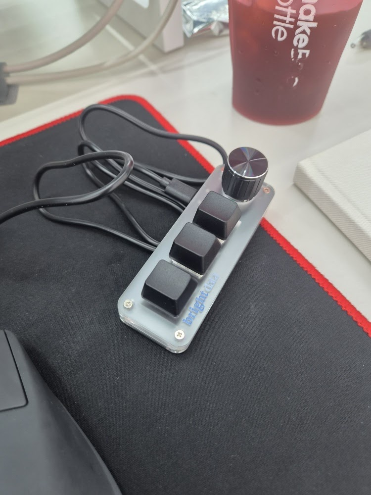

# brightdata-mini-keypad

Bright Data 굿즈로 배포된 **3키 + 노브** 미니 매크로 키패드(WCH CH57x, USB `1189:8890`)를
macOS 에서 프리셋 단위로 굽는 도구와 설정 모음.



공장 기본값이 **전 키 `c` 연타**(한글 입력 상태에선 `ㅊㅊㅊ`)라 그대로는 못 쓴다.
설정은 기기 **온보드 메모리**에 저장되므로, 한 번 구우면 드라이버 없이 어느 컴퓨터에서나 동작한다.

---

## 빠른 시작

```bash
# 1. 설정 도구 설치 (Rust)
cargo install ch57x-keyboard-tool          # Rust 없으면 https://rustup.rs 먼저

# 2. 기기가 붙어 있는지 확인
ioreg -p IOUSB -w0 -l | grep -q '"idProduct" = 34960' && echo 인식됨

# 3. 키 순서 확인 — 위·중간·아래 중 뭐가 키1인지는 눌러봐야 안다
./kp identify                              # 굽고 나서 텍스트 칸에 눌러보면 1/2/3 이 찍힌다

# 4. 원하는 프리셋 굽기
./kp mac-shottr
```

macOS 가 띄우는 **"키보드 식별 마법사"**(ANSI 고르라는 창)는 그냥 닫아도 된다. 하드웨어와 무관하다.

## 명령

```bash
./kp                 # 프리셋 목록 (→ 가 마지막으로 구운 것)
./kp <이름>           # 그 프리셋을 기기에 굽는다
./kp keys            # 기기가 지원하는 키 전체
./kp keys volume     # 키 이름 검색
```

## 프리셋

| 이름 | 키1 / 키2 / 키3 | 용도 |
|---|---|---|
| `mac-shottr` | `⌥2` / `⌥⇧S` / `⌃⇧Power` | [Shottr](https://shottr.cc) 전체·영역 캡처 + 화면만 끄기 |
| `mac-clipboard` | `⌃⌥⌘V` / `⌥⇧S` / `⌃⇧Power` | Raycast 클립보드 기록 + Shottr 영역 캡처 + 화면만 끄기 |
| `mac-lock` | `⌥2` / `⌥⇧S` / `⌃⌘Q` | 키3만 화면 잠금(암호 요구). 자리 비울 때 |
| `portable` | `prev` / `play` / `next` | 특정 앱·OS 에 의존하지 않음. Windows·Linux 에서도 동작 |
| `identify` | `1` / `2` / `3` | 새 기계에서 키 순서 확인용 |

노브는 전 프리셋 공통 — 좌: 볼륨 down / 누름: 음소거 / 우: 볼륨 up.

`mac-clipboard`는 Raycast의 **Clipboard History** 명령에 전역 핫키 `⌃⌥⌘V`를
지정해야 한다. 이 맥에는 2026-09-09에 지정했다. `./kp mac-clipboard`로 굽고,
기존 전체 캡처 버튼을 눌러 클립보드 기록이 열리는지 확인한다. 물리 키의 위·아래
위치는 추정하지 않는다. 원래 프리셋 복구: `./kp mac-shottr`.

검증 기록 (2026-09-09): 이 경로에서 `./kp mac-clipboard` exit 0으로 업로드,
`ch57x-keyboard-tool validate < presets/mac-clipboard.yaml`의 `config is valid` 확인.
맥에서 `⌃⌥⌘V` 호출 후 Raycast의 `Clipboard History`와 필터 입력창을 확인했다.
키패드의 실제 버튼 누름은 사용자 확인 대기 중이다.

## 커스텀

`presets/` 에 `.yaml` 을 하나 더 만들면 `./kp` 목록에 자동으로 뜬다.
기존 파일을 복사해서 `buttons` 줄만 바꾸는 게 가장 빠르다.

```yaml
model: ch57x-2
orientation: normal
rows: 1          # 3키 1노브 = 1행 3열 + 노브 1개
columns: 3
knobs: 1
layers:
  - buttons:
      - ["키1", "키2", "키3"]
    knobs:
      - ccw: "volumedown"      # 반시계
        press: "mute"          # 누름
        cw: "volumeup"         # 시계
```

- 쓸 수 있는 키 이름은 `./kp keys` 로 확인한다 — 문자·숫자·F1~F24·미디어키·마우스 클릭/휠/드래그.
- 모디파이어는 하이픈으로 잇는다: `ctrl` `shift` `alt`(=`opt`) `cmd`(=`win`) → `ctrl-cmd-q`
- 상위 모델(3×4 + 노브 2개 + 3레이어) 문법은 `reference/example-mapping.yaml` 참고.

---

## 알아둘 것

**키패드는 «키 조합»을 보낼 뿐 «동작»을 보내지 않는다.**
`⌥2` 는 Shottr 가 깔려 있고 같은 핫키를 쓰는 맥에서만 캡처가 된다. Shottr 가 없으면 그냥 `™` 가 입력된다.
노브(미디어키)만 OS 를 안 가린다.

**기기에서 설정을 되읽을 수 없다.** 도구에 download 기능이 없어서, 지금 무엇이 굽혀 있는지는
`.current` 파일 기록으로만 추적한다(git 미추적).

**C-to-C 케이블은 안 될 수 있다.** USB-C 장치는 CC 핀에 5.1kΩ 풀다운 저항이 있어야 호스트가
장치로 인식하는데, 저가 기기는 이걸 생략하는 경우가 흔하다. 안 붙으면 고장이 아니라 저항이
없는 것이다 — A-to-C 케이블로 쓰면 된다.

### 매크로로 할 수 있는 것 / 없는 것

한 키에 여러 키를 쉼표로 이어 넣을 수 있지만 제약이 크다.

| | 가능 여부 |
|---|---|
| 시퀀스 길이 | **최대 5키** (6키부터 기기가 거부) |
| 모디파이어 | **첫 키에만.** `cmd-c,cmd-tab,cmd-v` 불가 |
| 키 사이 지연 | **없음.** 창 전환 후 붙여넣기 같은 타이밍 의존 동작 불가 |
| 미디어키 | 시퀀스 안에 **불가** |
| 텍스트 입력 | 되지만 **한글 입력 상태면 깨진다** (`git status` → `ㅎㅑㅅ ㄴㅅㅁㅅㅕㄴ`) |

5키 안에 들어가면서 IME 영향도 안 받는 실용 예: `cmd-a,delete`(입력창 비우기), `escape,escape`.

**긴 매크로가 필요하면 키패드로 풀지 마라.** Raycast Script Command 등에 전역 핫키를
걸고 키패드는 그 핫키 하나만 쏘면, 길이·지연·조건 제약이 전부 사라진다.

### ⚠️ 매핑 금지

| 조합 | 결과 |
|---|---|
| `ctrl-cmd-power` | **저장 없이 강제 재시동.** 실행 중인 작업이 전부 죽는다 |
| `shift-cmd-q` | **로그아웃.** 세션의 모든 프로세스가 죽는다 |

화면 잠금은 `ctrl-cmd-q`(⌃⌘Q)다. 로그아웃 `⇧⌘Q` 와 끝 글자가 같아 실제로 헷갈린다.

참고로 **화면 잠금(`⌃⌘Q`)도 화면 끄기(`⌃⇧Power`)도 프로세스를 멈추지 않는다.**
실행 중인 작업을 멈추는 건 시스템 잠자기뿐이다.

---

## 함정

이 기기를 검색하면 나오는 안내 중 상당수가 **다른 기기의 것**이거나 사실이 아니다.

1. **Python 툴이 아니라 Rust다.** `pip install -r requirements.txt` 나
   `ch57x-keyboard-tool.py` 는 존재하지 않는 파일이다(업스트림 404 확인).
2. **`minikeyboard.top` · `sayodevice.com` · `key.soku.cc` 같은 웹 설정기로는 영원히 안 잡힌다.**
   SayoDevice 는 다른 회사의 다른 프로토콜이다. 이 기기는 raw USB control transfer 를 쓰므로
   WebHID 설정기와 무관하다. 브라우저를 바꾸거나 주소를 직접 입력해도 안 된다.
3. **`upload` 는 파일 인자를 받지 않는다 — stdin 전용이다.** `upload < mapping.yaml`
4. 이 3키 모델은 **시퀀스의 첫 키에만** 모디파이어가 붙는다.
   `ctrl-cmd-q` 는 되지만 `cmd-a,cmd-c` 는 `validate` 단계에서 거부된다.
5. **시퀀스는 5키가 상한이다. 그런데 `validate` 는 30키도 통과시킨다.**
   6키부터는 `upload` 가 `Error: bind key` 로 거부한다(실측). 즉 이 도구에서
   `validate` 통과는 기기가 받아준다는 뜻이 아니다 — 반드시 `upload` 까지 돌려봐라.
   그래서 `/clear`(7키)·`/compact`(9키) 같은 텍스트 매크로는 **넣을 수 없다.**
6. 시퀀스에 **미디어키는 못 들어간다**(`volumeup,volumeup` 은 로드 단계에서 실패).

## AI 에이전트로 세팅하기

Claude Code 등에 그대로 붙여넣을 프롬프트가 `docs/SETUP-PROMPT.md` 에 있다.
위 함정들을 미리 박아둬서 엉뚱한 길로 새지 않는다.

## 출처

- 설정 도구: [kriomant/ch57x-keyboard-tool](https://github.com/kriomant/ch57x-keyboard-tool) (MIT)
